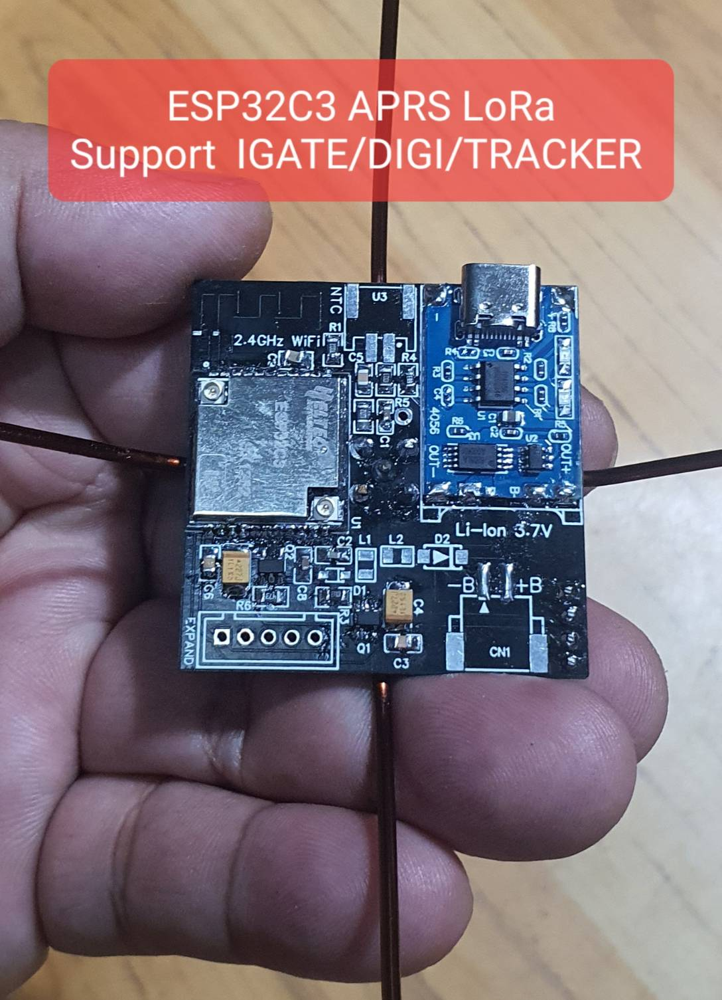
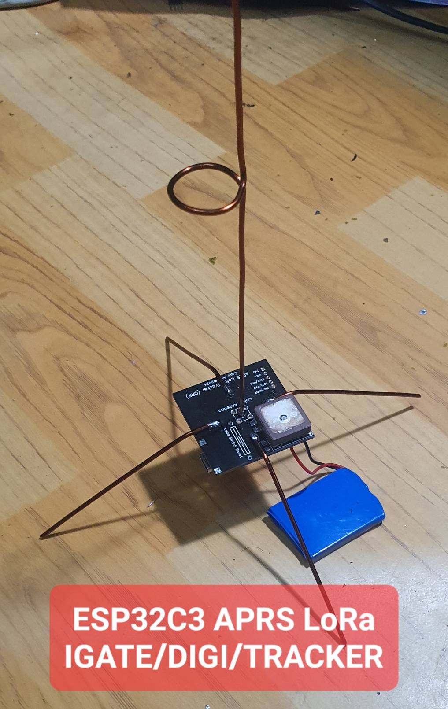
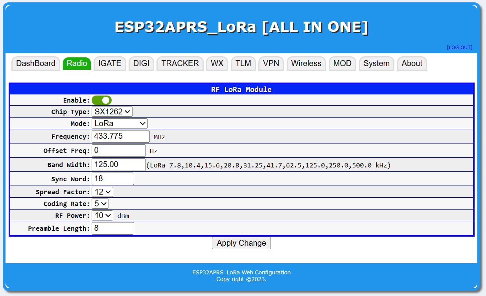
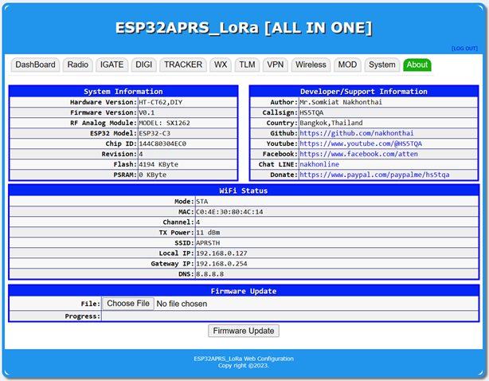

# ESP32APRS LoRa Simple Project

ESP32IAPRS LoRa is a Internet Gateway(IGate)/Dital Repeater(DiGi)/Tracker/Weather(WX)/Telemetry(TLM) with LoRa RF network in that is implemented for Espressif ESP32,ESP32-S3,ESP32C3 processor support.
 

## Feature
* Supported APRS on AX.25 Protocol
* Supported hardware: TTGO_LoRa32,TTGO-T-Beam,Heltec,HT-CT62,D.I.Y Mod GPIO
* Support APRS internet gateway (IGATE)
* Support APRS digital repeater (DIGI)
* Support APRS tracker (TRACKER)
* Support GNSS External mod select UART0-2 and TCP Client
* Support TNC External mod select UART0-2 and Yaesu packet
* Support APRS IGATE/DIGI/WX with fix position for move position from GNSS
* Using ESP-Arduino development on Visual studio code + Platform IO
* Support LoRa Chip SX1231,SX1233,SX1261,SX1262,SX1268,SX12732,SX1273,SX1276,SX1278,SX1279,SX1280,SX1281,SX1282
* Support Frequncy by LoRa Chip 137Mhz-1020Mhz
* Support monitor display information and statistices
* Support Wi-Fi multi station or WiFi Access point
* support Web Service config and control system
* support filter packet rx/tx on igate,digi,display
* support VPN wireguard
* support global time zone
* support web service auth login
* display received and transmit packet on the LED and display OLED

## Hardware screen short
  

## Web service screen short

  \
 

## ESP32APRS LoRa firmware installation (do it first time, next time via the web browser)
- 1.Connect the USB cable to the ESP32 Module.
- 2.Download firmware and open the program ESP32 DOWNLOAD TOOL, set it in the firmware upload program, set the firmware to ESP32APRS_LoRa_Vxx.bin, location 0x10000 and partitions.bin at 0x8000 and bootloader.bin at 0x1000 (ESP32-C3 at 0x0000) and boot.bin at 0xe000, if not loaded, connect GPIO0 cable to GND, press START button finished, press power button or reset (red) again.
- 3.Then go to WiFi AP SSID: ESP32APRS_LoRa and open a browser to the website. http://192.168.4.1 password: aprsthnetwork Can be fixed Or turn on your Wi-Fi router.
- 4.Push **BOOT** button long >100ms to TX Position and >10Sec to Factory Default

## ESP32 Flash Download Tools
https://www.espressif.com/en/support/download/other-tools

## PlatformIO Quick Start

1. Install [Visual Studio Code](https://code.visualstudio.com/) and [Python](https://www.python.org/)
2. Search for the `PlatformIO` plugin in the `VisualStudioCode` extension and install it.
3. After the installation is complete, you need to restart `VisualStudioCode`
4. After restarting `VisualStudioCode`, select `File` in the upper left corner of `VisualStudioCode` -> `Open Folder` -> select the `ESP32APRS_LoRa` directory
5. Click on the `platformio.ini` file, and in the `platformio` column, cancel the sample line that needs to be used, please make sure that only one line is valid and change ESP type HT-CT62 Module as `default_envs = ht-ct62` or TTGO LoRa32 V1 as `default_envs = ttgo-lora32-v1`
6. Click the (✔) symbol in the lower left corner to compile
7. Connect the board to the computer USB
8. Click (→) to upload firmware and reboot again
9. After reboot display monitor and reconfig

## APRS Server service

- APRS SERVER of T2THAI at [aprs.dprns.com:14580](http://aprs.dprns.com:14501)
- APRS SERVER of T2THAI ampr host at [aprs.hs5tqa.ampr.org:14580](http://aprs.hs5tqa.ampr.org:14501)
- APRS MAP SERVICE [http://aprs.nakhonthai.net](http://aprs.nakhonthai.net)

## Donate

To support the development of ESP32APRS you can make us a donation using [github sponsors](https://github.com/sponsors/nakhonthai). \
If you want to donate some hardware to facilitate APRS porting and development, [contact us](https://www.facebook.com/atten). \
 

## ESP32 Flash Download Tools
https://www.espressif.com/en/support/download/other-tools

## Credits & Reference

- APRS Library by markqvist [LibAPRS](https://github.com/markqvist/LibAPRS)

## HITH
This project implement by APRS text (TNC2 Raw) only,It not support null string(0x00) in the package.
